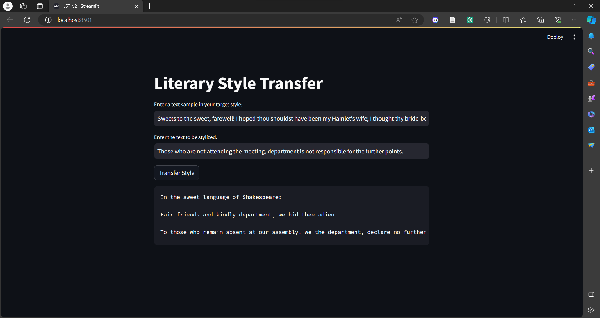
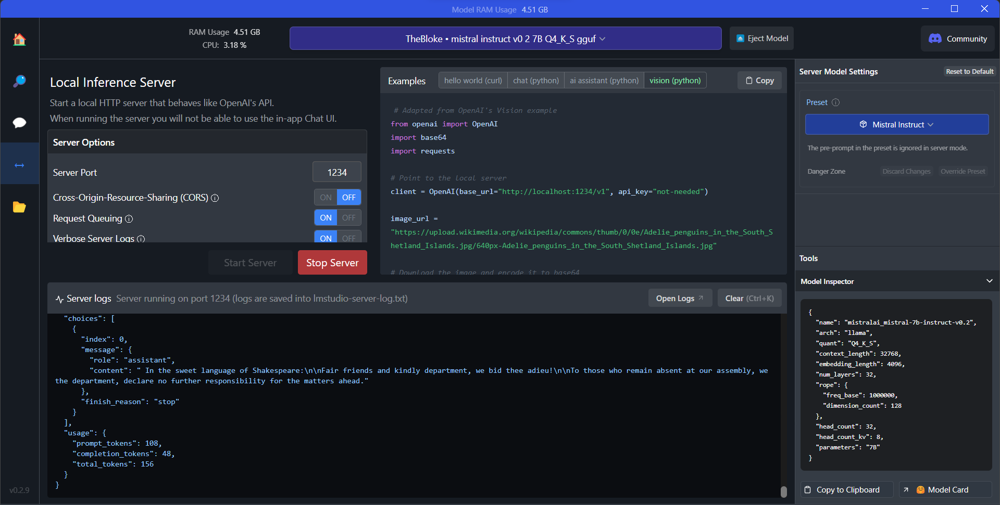

# News Research Tool


 ## Installation
## Clone
```bash
$ git clone https://github.com/shreyahegde18/Literary-Style-Transfer.git
```


## Create a new Virtual Environment and install requirements.txt
```bash
$ python3 -m venv venv #for Linux
$ source venv/bin/activate #for Linux
$ pip install -r requirements.txt
```

## Install LM Studio [here](https://lmstudio.ai/)

- Download Mistral 7B in LM studio
- Start the Server 



## Run with Streamlit
```bash
$ streamlit run lst_v2.py
```
 Play around with different models available @LM Studio